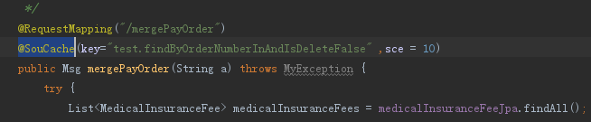
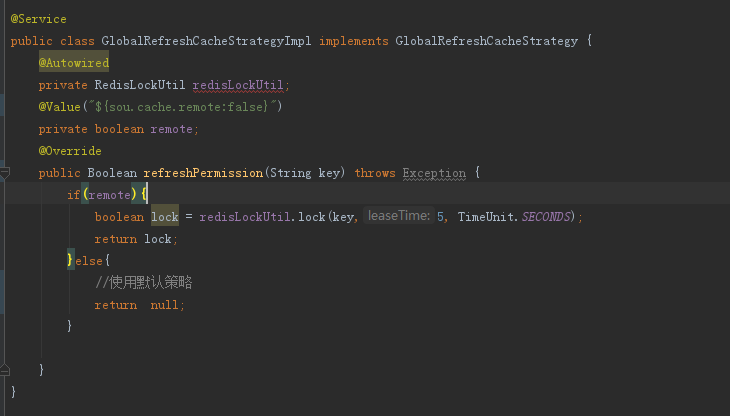

# sou-cache

#### 介绍
sou-cache是基于Spring开发的缓存插件，能动态刷新缓存，快速上手轻松提高系统访问量。
 
#### 软件架构

#### 安装教程

1.    
    引入hutool工具

             <dependency>
                <groupId>cn.hutool</groupId>
                <artifactId>hutool-all</artifactId>
                <version>5.7.3</version>
                <optional>true</optional>
            </dependency>

2.  下载sou-cache-1.0-SNAPSHOT.jar引入项目

#### 使用说明

1.  配置application.properties

| 参数名称                                 | 说明                                                         | 默认值   |
|--------------------------------------|------------------------------------------------------------|-------|
| sou.cache.remote.timeout.add.seconds | 远程缓存最大有效期 =缓存时间+配置时间，单位秒。如：缓存过期时间10秒，则redis的保存时间为60+10=70秒 | 60    |
| sou.cache.open                       | 是否开启缓存                                                     | false |
| sou.cache.remote                     | 是否开启远程缓存                                                   | false |
| spring.application.name              | redis缓存根目录                                                | |

2.  注解配置说明

| 参数名称                                 | 说明                                                         | 默认值   |
|--------------------------------------|------------------------------------------------------------|-------|
| sce | 	缓存秒数 | 0 |
| key                      | 缓存的key                                                    | null|
| refresh | 默认刷新缓存的比例，0-100 过期缓存刷新几率。10.就会有10%拿到过期缓存的请求去刷新缓存数据0代表不允许返回过期缓存| 10|                                              

3.  使用注解
@SouCache
如下图，使用key保存当前接口，缓存时间10秒

4.  自己定义刷新策略
实现GlobalRefreshCacheStrategy 的refreshPermission接口
如：

#### 参与贡献

1.  hongzihao

